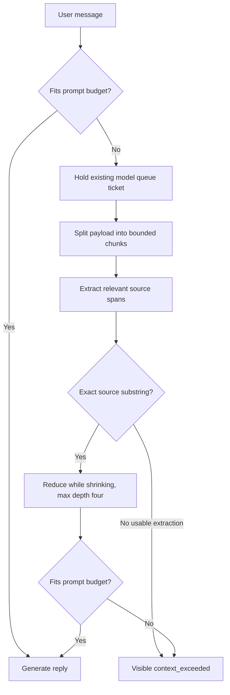

# Context overflow fallback: original concept

This paper introduced the context-overflow problem and sketched two possible
responses: compressing context or selecting a larger-context model. Its original
Builder Instructions and open-ended recursive flow have been superseded by the
approved, bounded T1 declaration in [`../PLAN.md`](../PLAN.md). The project goal
and stop conditions are in [`PROJECT-CHARTER.md`](PROJECT-CHARTER.md).

The active T1 repair supports only one oversized user message containing a
document-like payload followed by a final explicit `Question:` section. It
preserves the question verbatim, retains bounded beginning and ending source
text, extracts question-relevant exact spans from the middle, and records
provenance. Chunks are character-size bounded with about 12% overlap and prefer
line/sentence boundaries; the eight-chunk cap is per pass and every overlapping
chunk counts toward it. Matching allows whitespace normalization only, then
snaps outward at line or sentence granularity and merges overlaps. Reduction is
recursive but bounded by strict per-level shrinkage, a total-call cap, one shared
generation deadline, and a depth backstop of four. No arbitrary-format parsing,
general instruction inference, or transformation routing is claimed.

Preflight is the primary overflow trigger. Ollama truncation is disabled; the
single reactive context-error retry is Ollama-only. An oversized system prompt
fails immediately because it is not user payload. Retrieval for an oversized
message uses a bounded `Question:` query, never the whole document. Extraction
stays under the model's existing queue ticket and emits bounded progress. T1
does not add a larger-model route, graph rehydration, or a general plugin system.

The queue ticket covers extraction and the final reply under one generation-wide
timeout. Progress reports completed chunks or reduction work. The assistant
turn's `window.derived` record carries the method, version, bounded depth,
transformed text, and source references so the prompt representation can be
inspected without replacing the source event history.
