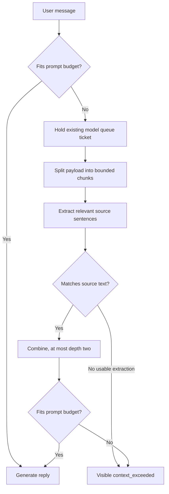

# Context overflow fallback: original concept

This paper introduced the context-overflow problem and sketched two possible
responses: compressing context or selecting a larger-context model. Its original
Builder Instructions and open-ended recursive flow have been superseded by the
approved, bounded T1 declaration in [`../PLAN.md`](../PLAN.md). The project goal
and stop conditions are in [`PROJECT-CHARTER.md`](PROJECT-CHARTER.md).

T1 addresses an oversized document payload followed by an explicit final
`Question:` section. It preserves the question, retains bounded beginning and
ending source text, extracts question-relevant source sentences from the middle,
and records provenance. Preflight is primary; Ollama truncation is disabled so a
reported overflow can serve as a one-attempt safety net. Extraction stays under
the model's existing queue ticket and emits bounded progress. T1 does not add a
larger-model route, graph rehydration, or a general plugin system.

The queue ticket covers extraction and the final reply under one generation-wide
timeout. Progress reports completed chunks. The assistant turn's `window.derived`
record carries the method, version, transformed text, and source references so
the prompt representation can be inspected without replacing the source event
history.
