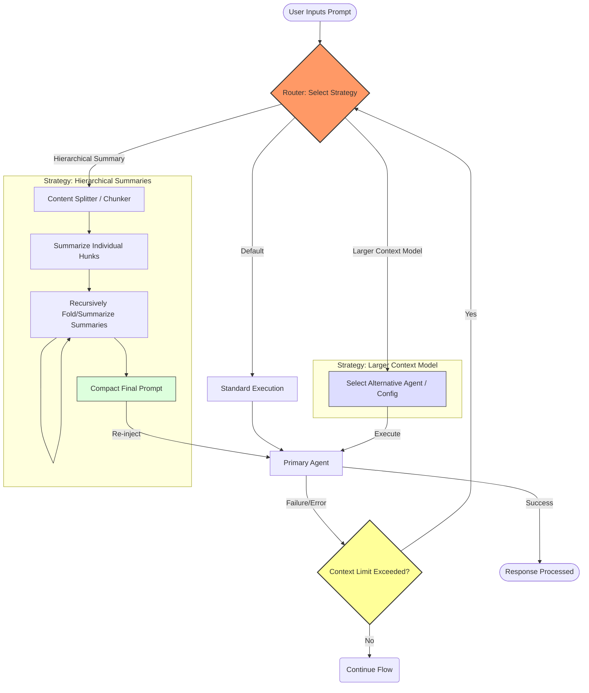

# Architecture Document: Context Overflow Fallback (V1)

Historical concept paper for the context-scaling project. Its core idea—recover
from a request that cannot fit—is active input to the project charter. Its
specific scaffolding instructions are proposals, not current implementation
requirements. The active product target, invariants, and stop conditions are in
[`PROJECT-CHARTER.md`](PROJECT-CHARTER.md); tranche-level decisions belong in
[`../PLAN.md`](../PLAN.md). The harness already builds bounded message windows,
so any fallback must be designed at that existing generation path.

## Overview
This document outlines the V1 architecture for a "circuit breaker" fallback mechanism designed to handle context overflow errors in local LLMs. It defines a routing layer that intercepts oversized prompts and manages them through either hierarchical summarization or routing to a larger context model. 

*Note to Builder: V1 is strictly a memory safety net. Do NOT implement dynamic graph rehydration or state tracking for unpacking specific hunks. The goal is a dumb, reliable fallback to prevent out-of-bounds errors.*

## System Flow (Mermaid)

## Builder Instructions

**Goal:** Scaffold a modular Python class (e.g., `ContextOverflowRouter`) that manages the execution of LLM prompts and handles context window overflow errors by dynamically switching between two strategies. 

**Implementation Guidelines:**

1. **Initialization:** The class should be initialized with two agent interfaces (or configurations):
    *   `primary_agent`: The standard model for typical requests.
    *   `fallback_agent`: A model or config with a larger context window.
2. **Execution Method:** Create an `execute` entry point that accepts a `prompt` string and an optional `strategy` flag (e.g., `"hierarchical_summary"` or `"larger_context"`).
3. **Strategy A - Larger Context:** If selected, re-run the *exact same original prompt* using the `fallback_agent`.
4. **Strategy B - Hierarchical Summary (Core Logic):** If this strategy is selected (or if a standard execution throws a context limit exception), the system must:
    *   Pass the oversized prompt to an internal `Splitter` interface to divide it into manageable hunks.
    *   Generate summaries for *each* individual hunk.
    *   Recursively summarize those summaries ("summary of summaries") until the output fits the `primary_agent`'s context window.
    *   Re-inject the condensed prompt back into the `primary_agent`.

**Design Philosophy:**
Keep the specific implementations for the Splitter (Tree-sitter, Regex, etc.) and Summarizer abstract. Use stubs, base classes, or interfaces for now. Let the concrete code emerge cleanly as the project develops. Focus entirely on the scaffolding, routing, and error-catching loops.
